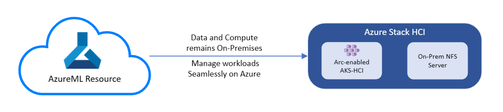

# Setup and Run AzureML Training & Inferencing Workloads On-Premises Using AKS on Azure Stack HCI Via Azure Arc 

This repository is intended to serve as an information hub for AKS on Azure Stack HCI customers and partners who are interested in Arc AML training using ARC Connected AKS cluster and NFS Server on Azure Stack HCI. Use this repository for onboarding and testing instructions as well as an avenue to provide feedback, issues, enhancement requests and stay up to date as the public preview progresses.

            

## Setup Azure Arc-enabled Machine Learning on AKS on Azure Stack HCI

You can use the following documents to get started with setting up your Azure Arc-enabled Machine Learning on AKS on Azure Stack HCI:

1. [Setup Azure Arc-enabled Machine Learning Training and Inferencing on AKS on Azure Stack HCI](AML-ARC-Compute.md)
2. [Setup NFS Server on Azure Stack HCI and Use your Data and run managed Machine Learning Experiments On-Premises](Train-AzureArc.md)

## Sample Notebooks

After following the setup documents, you can go through the sample notebooks linked below to get a better understanding of how the process works and the possibilities it can unlock:

* [Image Classification Using Scikit-learn](notebooks/mnist/MNIST_Training_with_AKS-HCI_Cluster_and_NFS.ipynb) (Image Classification)

  This notebook serves as "hello world" of using for training and inference with AKS-HCI Cluster, on-premise NFS Server, and Azure Machine Learning, including
  * Training with AKS-HCI cluster and on-premise NFS Server
  * Register model
  * Inference with the registered model on AKS-HCI cluster
  * Test model

## CLI v2 Examples

### Prerequisites 

Follow this [document](https://docs.microsoft.com/en-us/azure/machine-learning/how-to-train-cli?view=azure-devops#prerequisites) to set up the prerequisites of using Azure Machine Learning CLI v2.  

### Examples

* [Image Classification Using Scikit-learn](cli/mnist/README.md) (Image Classification)

  This example serves as "hello world" of using for training and inference with AKS-HCI Cluster, on-premise NFS Server, and Azure Machine Learning, including
  * Training with AKS-HCI cluster and on-premise NFS Server
  * Register model
  * Inference with the registered model on AKS-HCI cluster
  * Test model

## Troubleshooting

If you face issues during setup or experimenting, please check out [Limitations and known issues](../limitations-and-known-issues.md) and [Support](../../README.md#support) pages.
