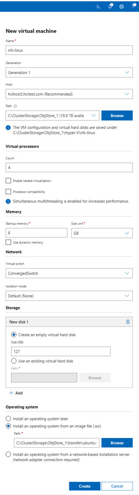
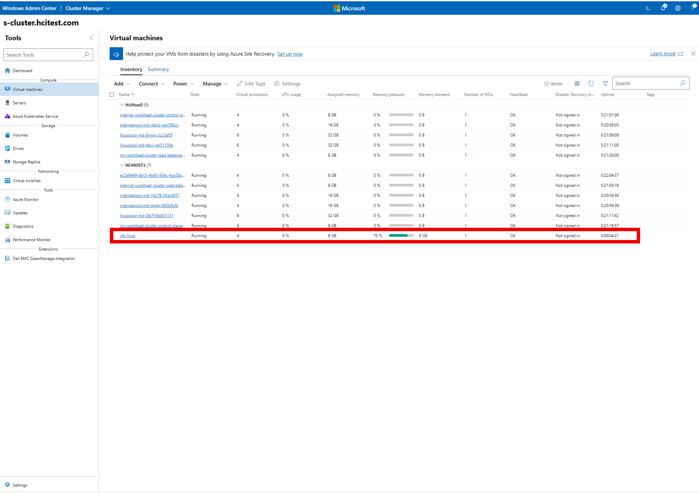
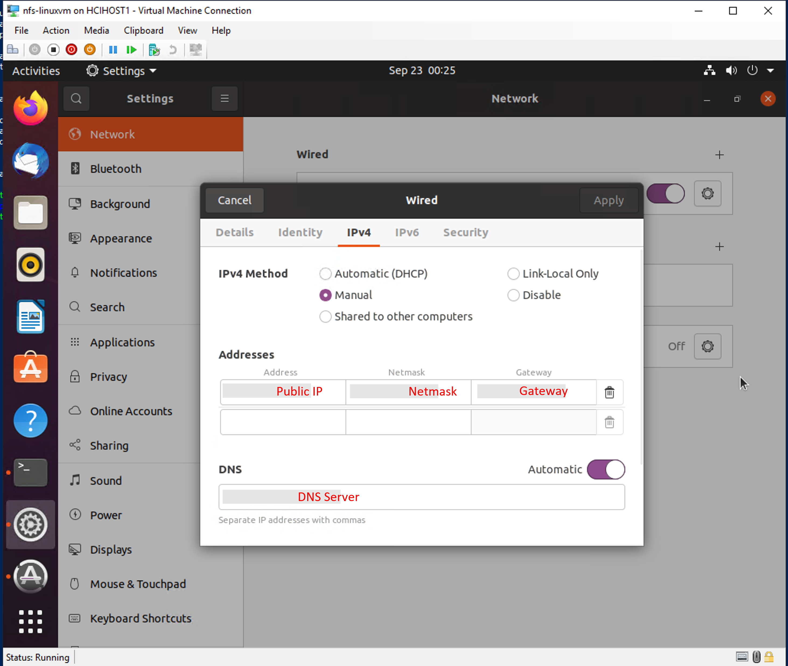
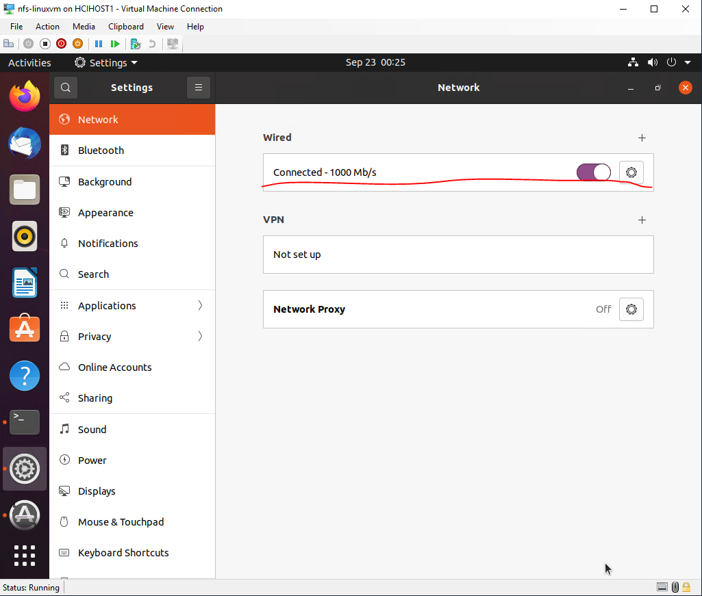
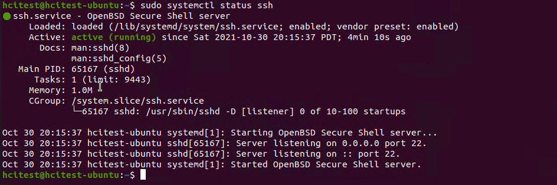
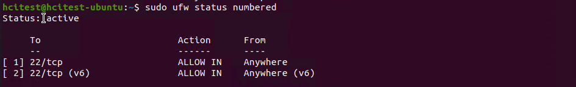
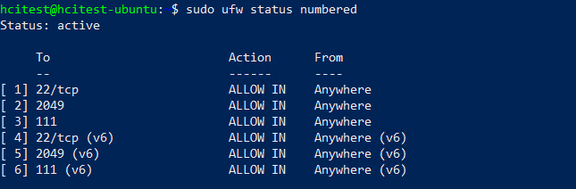

# Setup NFS Server on Azure Stack HCI and Use your Data and run managed Machine Learning Experiments On-Premises

In this article, you:
* How to set up an NFS server on Azure Stack HCI
* Configure the NFS server as the training data source (where you hold all your training data)
* Verify the NFS server setup using a sample notebook

## Setting up the NFS Server

You can follow this [link](https://help.ubuntu.com/community/SettingUpNFSHowTo) to setup an NFS server on an Ubuntu machine. The Ubuntu machine can be hosted on Azure Stack HCI or in the place which AKS-HCI cluster can access. Below shows an example how to setup an NFS Server on Azure Stack HCI VM. If you already have an NFS Server that AKS-HCI cluster can access, you can skip step this part and go to **Configure the NFS server as the training data source**.

1. Deploy a Ubuntu VM on Azure Stack HCI.

Helper link of creating VM on Azure Stack HCI: https://docs.microsoft.com/en-us/azure-stack/hci/manage/vm#create-a-new-vm

* Download the Ubuntu ISO file from https://ubuntu.com/download/desktop
* Select **Generation 1** (Recommended for Linux VMs)
* Choose **Install an operation system from an image file(.iso)** and load the Ubuntu ISO file from local.

Example, creating Ubuntu VM with ISO on Azure Stack HCI.

<p align="center">
  
</p>

After the deployment finishes successfully, you can see the VM from Windows Admin Center.

<p align="center">
  
</p>

2. Prerequisites on Ubuntu VM

To make sure the Ubuntu VM NFS Server can be accessed externally, if you don't use DHCP, you need to assign the public IP manually. Like,

<p align="center">
  
</p>

Then reset the network to take effect.

<p align="center">
  
</p>

About SSH, you need to install openSSH server and open the required port - 22.

First update the system and install openssh-server package, run,

```shell
sudo apt update
sudo apt upgrade
sudo apt install openssh-server
```
Verify the ssh service running status
```shell
sudo systemctl status ssh
```
<p align="center">
  
</p>

If the SSH service is not started automatically, you can start (or restart) the SSH service manually via below command:
```shell
sudo service ssh start
```
To make sure the Ubuntu VM can be connected from a remote location, need to enable UFW firewall and add a rule to allow incoming SSH connections.

To configure the UFW firewall and add a rule to allow incoming SSH connections.
```shell
sudo ufw allow ssh
```
Then enable UFW firewall via below command:
```shell
sudo ufw enable
```
Then check the status of UFW:
```shell
sudo ufw status numbered
```
<p align="center">
  
</p>


3. Setup the NFS Server on the Ubuntu VM.

Here is the script to setup an NFS Server within your Ubuntu virtual machine - [nfs-server-setup.sh](nfs/nfs-server-setup.sh)

After you've created your VM, copy the script to your machine, then into the VM using: 

```shell
scp /path/to/script_file username@vm-ip-address:/home/{username}
```
If you copy the script from Windows machine, please pay attention to the format, could use dos2unix to convert the format:
```shell
sudo apt install dos2unix
dos2unix ~/nfs-server-setup.sh
```
Once your script is in your VM, you can ssh into the VM and execute it via the command:

```shell
sudo ~/nfs-server-setup.sh
```
If its execution fails because of a permission denied error, set execution permission via the command:

```shell
chmod +x ~/nfs-server-setup.sh
```

In [nfs-server-setup.sh](nfs/nfs-server-setup.sh), it accepts two parameters,
* The first one is DATA_DIRECTORY, indicating a folder which is used as the data store for NFS server
* The second one is AKS_SUBNET, indicating Kubernetes subnet address. Make sure to replace the AKS_SUBNET with the correct one from your cluster or else "*" will open your NFS Server to all ports and connections.

The NFS server will restart (because of the script) and you can mount the NFS Server for AKS-HCI. The mounting point is <NFS_IP>:/$(basename $DATA_DIRECTORY).

Configure the UFW firewall to allow the NFS incoming connection.
```shell
sudo ufw allow from any to any port nfs
sudo ufw allow from any to any port 111
```
<p align="center">
  
</p>

You can verify the mounting point on another Ubuntu machine, with nfs-common installed and the network access to the NFS server.
```shell
# install nfs client
sudo apt install nfs-common -y
# mount: </path/to/desired/mountpoint> needs to be created in advance
sudo mount -t nfs <NFS_IP>:<folder name of DATA_DIRECTORY> </path/to/desired/mountpoint>
# umount
sudo fusermount -u </path/to/desired/mountpoint>
```
<p align="center">
  
</p>

## Configure the NFS server as the Training Data Source

Follow the [doc](../setup-ephemeral-nfs-volume.md), complete the steps after setting up the NFS server.

[mount-config.yaml](nfs/mount-config.yaml) shows an example config as the following.

```yaml
apiVersion: v1
data:
  mounts.yaml: |
    mountPoints:
    - mountPath: <Mounting path on training pod>
      mountType: nfs
      name: <NFS_NAME>
      path: <NFS_EXPORT_FILE_PATH>
      server: <NFS_IP>
kind: ConfigMap
metadata:
  name: mount-config
  namespace: azureml
```

## Verify the NFS Setup

You can verify your NFS setup using [Verify the NFS Setup in AMLArc Notebook](nfs/Verify_NFS_Setup_in_AMLArc.ipynb).

## Next steps

* Experiment with ArcML on AKS on Azure Stack HCI using [Interactive Python Notebooks and AzureML CLI V2 Sample Examples](../AKS-HCI#sample-notebooks).
