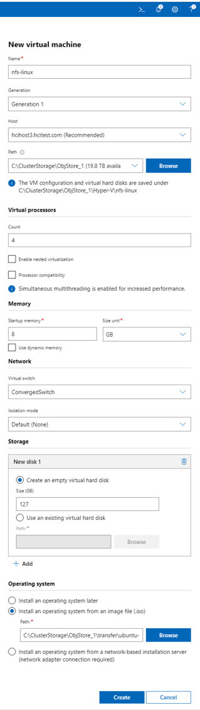
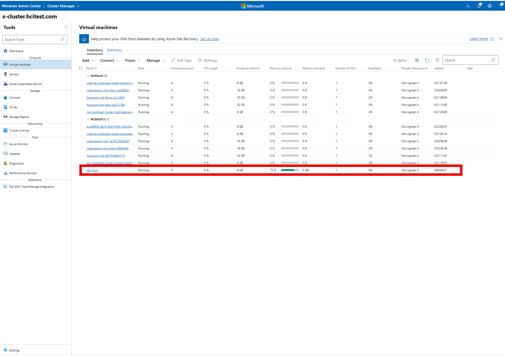
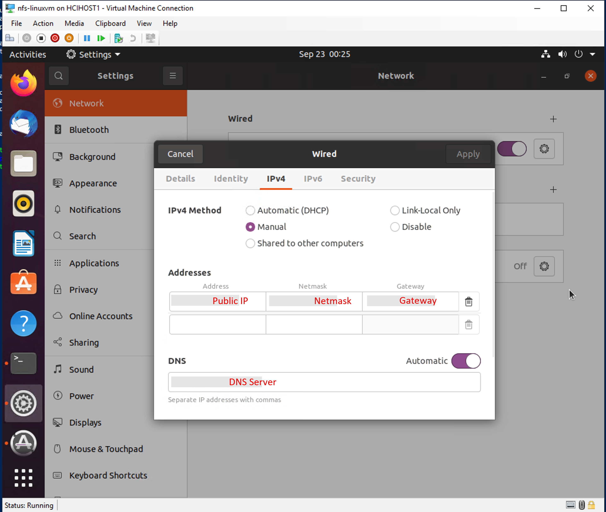
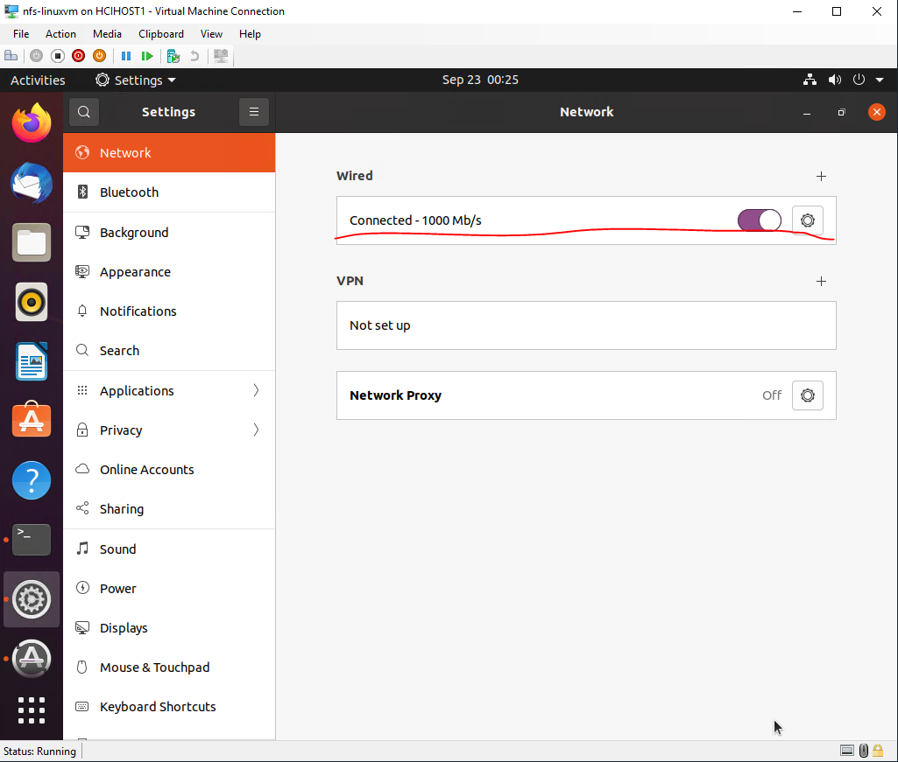

# Setup NFS Server on Azure Stack HCI and Use your Data and run managed Machine Learning Experiments On-Premises

In this article, you:
* How to setup an NFS server on Azure Stack HCI
* Configure the NFS server as the training data source (where you hold all your training data)
* Run your first Azure Machine Learning training job on AKS-HCI using AzureML Python SDK (example notebooks)

## Setting up the NFS Server

You can follow this [link](https://help.ubuntu.com/community/SettingUpNFSHowTo) to setup an NFS server on an Ubuntu machine. The Ubuntu machine can be hosted on Azure Stack HCI or in the place which AKS-HCI cluster can access. Below shows an example how to setup an NFS Server on Azure Stack HCI VM. If you already have an NFS Server that AKS-HCI cluster can access, you can skip step this part and go to **Configure the NFS server as the training data source**.

1. Deploy a Ubuntu VM on Azure Stack HCI.

Helper link of creating VM on Azure Stack HCI: https://docs.microsoft.com/en-us/azure-stack/hci/manage/vm#create-a-new-vm

* Download the Ubuntu ISO file from https://ubuntu.com/download/desktop
* Select **Generation 1** (Recommended for Linux VMs)
* Choose **Install an operation system from an image file(.iso)** and load the Ubuntu ISO file from local.

Example, creating Ubuntu VM with ISO on Azure Stack HCI.

<p align="center">
  
</p>

After the deployment finishes successfully, you can see the VM from Windows Admin Center.

<p align="center">
  
</p>

2. Configure the network of the Ubuntu VM.

To make sure the Ubuntu VM NFS Server can be accessed externally, if you don't use DHCP, you need to assign the public IP manually. Like,

<p align="center">
  
</p>

Then reset the network to take effect.

<p align="center">
  
</p>

3. Setup the NFS Server on the Ubuntu VM.

Here is the script to setup an NFS Server within your Ubuntu virtual machine - [nfs-server-setup.sh](nfs/nfs-server-setup.sh)

After you've created your VM, copy the script to your machine, then into the VM using: 

```shell
scp /path/to/script_file username@vm-ip-address:/home/{username}
```

Once your script is in your VM, you can ssh into the VM and execute it via the command:

```shell
sudo ~/nfs-server-setup.sh
```
If its execution fails because of a permission denied error, set execution permission via the command:

```shell
chmod +x ~/nfs-server-setup.sh
```

In [nfs-server-setup.sh](nfs/nfs-server-setup.sh), it accepts three parameters,
* The first one is EXPORT_DIRECTORY, indicating a folder to be exported.
* The second one is DATA_DIRECTORY, indicating a folder where data locates.
* The third one is AKS_SUBNET, indicating Kubernetes subnet address. Make sure to replace the AKS_SUBNET with the correct one from your cluster or else "*" will open your NFS Server to all ports and connections.

The NFS server will restart (because of the script) and you can mount the NFS Server for AKS-HCI.

## Configure the NFS server as the training data source

Follow the [doc](../setup-ephemeral-nfs-volume.md), complete the steps after setting up the NFS server.

[mount-config.yaml](nfs/mount-config.yaml) shows an example config as the following.

```yaml
apiVersion: v1
data:
  mounts.yaml: |
    mountPoints:
    - mountPath: <Mounting path on training pod>
      mountType: nfs
      name: amlarc-nfs-share-0
      path: <EXPORT_DIRECTORY in nfs-server-setup.sh>
      server: <IP of the NFS Ubuntu VM>
kind: ConfigMap
metadata:
  name: mount-config
  namespace: azureml
```