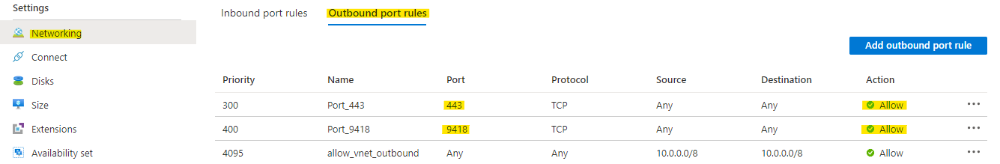

# Deploy Azure Stack Hub’s Kubernetes Cluster as a Compute Cluster in Azure Machine Learning through Azure Arc (Private Preview)

In this article, you:

*	Deploy a Kubernetes cluster on Azure Stack Hub
*	Install a preview version of provided Kubernetes Extension (private preview)
*	Connect Azure Stack Hub’s Kubernetes cluster to Azure via Azure ARC
*	Create an Azure Machine Learning workspace on Azure (if not already deployed)
*	Attach Azure Arc’s Kubernetes cluster as Azure Machine Learning compute target (private preview)

## Prerequisites

Make sure you have access to Azure and your Azure Stack Hub is ready for use.
To deploy a Kubernetes cluster from the Azure Stack Hub marketplace:

*	If you are planning on deploying Kubernetes using Azure Active Directory (Azure AD) please make sure the following [Prerequisites](https://docs.microsoft.com/en-us/azure-stack/user/azure-stack-solution-template-kubernetes-azuread?view=azs-2008#prerequisites) are met.
*	If you are planning on deploying Kubernetes using Active Directory Federated Services please make sure the following [Prerequisites](https://docs.microsoft.com/en-us/azure-stack/user/azure-stack-solution-template-kubernetes-adfs?view=azs-2008#prerequisites) are met.

Only use the Kubernetes Azure Stack Marketplace item to deploy clusters as a proof-of-concept. For supported Kubernetes clusters on Azure Stack, use the AKS engine. Please make sure you meet [Azure Stack Hub’s AKS engine requirements](https://docs.microsoft.com/en-us/azure-stack/user/azure-stack-kubernetes-aks-engine-set-up?view=azs-2008#prerequisites-for-the-aks-engine). 

To connect Azure Stack Hub’s Kubernetes cluster to Azure via Azure ARC please make sure the following [Prerequisites](https://docs.microsoft.com/en-us/azure/azure-arc/kubernetes/connect-cluster#before-you-begin) are met. Please skip the last requirement (Arc enabled Kubernetes CLI extensions) as you will be installing a private preview of the extension later in this document.

To create an Azure Machine Learning workspace on Azure please make sure the following [Prerequisites](https://docs.microsoft.com/en-us/azure/machine-learning/how-to-manage-workspace?tabs=python#prerequisites) are met (we recommend using the Python SDK when communicating with Azure Machine Learning so make sure the SDK is properly installed). We strongly recommend learning more about [the innerworkings and concepts in Azure Machine Learning](https://docs.microsoft.com/en-us/azure/machine-learning/concept-azure-machine-learning-architecture) before continuing with the rest of this article (optional).

## Deploy a Kubernetes cluster on Azure Stack Hub

First things first, we need to deploy a Kubernetes cluster on Azure Stack Hub. You can either use Azure Active Directory (Azure AD) (recommended) or Active Directory Federated Services for deployment of a Kubernetes cluster using Azure Stack Marketplace:

*	Using Azure Active Directory (Azure AD): Please follow the [instructions here](https://docs.microsoft.com/en-us/azure-stack/user/azure-stack-solution-template-kubernetes-azuread?view=azs-2008#create-a-service-principal)
*	Active Directory Federated Services: Please follow the [instructions here](https://docs.microsoft.com/en-us/azure-stack/user/azure-stack-solution-template-kubernetes-adfs?view=azs-2008#create-a-service-principal)

If you do not have Kubernetes Cluster in your marketplace, please talk to your Azure Stack Hub administrator. 

Please note that the Kubernetes Azure Stack Marketplace item to deploy clusters should be used as a proof-of-concept. For supported Kubernetes clusters on Azure Stack, use the AKS engine. Follow the following two links to setup your Kubernetes cluster on Azure Stack using the AKS engine:

1.	[Install the AKS engine on Linux in Azure Stack Hub](https://docs.microsoft.com/en-us/azure-stack/user/azure-stack-kubernetes-aks-engine-deploy-linux?view=azs-2008)
2.	[Deploy a Kubernetes cluster with the AKS engine on Azure Stack Hub](https://docs.microsoft.com/en-us/azure-stack/user/azure-stack-kubernetes-aks-engine-deploy-cluster?view=azs-2008)

**IMPORTANT: For either approach (Marketplace and AKS engine) make sure to create a [supported version of Kubernetes](https://docs.microsoft.com/en-us/azure/aks/supported-kubernetes-versions#kubernetes-version-support-policy) before continuing forward.**

## Connect Azure Stack Hub’s Kubernetes cluster to Azure via Azure ARC (Private Preview)

Before we start the process of connecting our newly created Kubernetes cluster to Azure, we need to install the most recent Arc enabled Kubernetes CLI extensions on our cluster (private preview):

*	Get the public IP address of one of your master nodes (VM) using the Azure Stack Hub portal.
*	From a machine with access to your Azure Stack Hub instance, connect via SSH into the new master node using a client such as Command Prompt or PuTTY.
*	Install (or update) Azure CLI on your cluster’s master node by following the information found here. If Azure CLI is already installed on the node, please check the CLI version by running ‘az -v’ on node’s terminal. Installing the provided preview version of Kubernetes Extension requires Azure CLI version of 2.12.0 or greater. 
*	Install the preview version of k8s-extensions CLI extension provided in this repository by running the following command (make sure your present working directory is root of the repository):

    ```az extension add --source ./extensions/connectedk8s-0.3.2-py2.py3-none-any.whl –yes```
    
    Note: Check If you already have a connectedk8s CLI extension with version older than 0.3.1 installed by running ‘az -v’ on node’s terminal. If there is a connectedk8s CLI extension installed, please remove it by running the following command:

    ```az extension remove --name connectedk8s```

*	Install the preview version of k8s-extension CLI extension provided in this repository by running the following command (make sure your present working directory is root of the repository):

    ```az extension add --source ./extensions/k8s_extension-0.1.0-py2.py3-none-any.whl –yes```

    Note: Check If you already have a k8s-extension CLI extension with version older than 0.3.1 installed by running ‘az -v’ on node’s terminal. If there is a connectedk8s CLI extension installed, please remove it by running the following command:

    ```az extension remove --name k8s-extension```

*	Register Microsoft.KubernetesConfiguration Resource Provider in your subscription by running the following command:

    ```az provider register --namespace Microsoft.KubernetesConfiguration```

*	Register extensions feature flag by running the following command: 

    ```az feature register --namespace Microsoft.KubernetesConfiguration --name extensions```

    Within a few minutes, the feature will be automatically approved.

*	Stay connected to master nodes VM and complete below networking requirements through Azure Stack Hub portal.

Azure Arc agents require a few networking protocols/ports/outbound URLs to function. Please make sure the master node in your deployed Kubernetes cluster allows outbound TCP network traffic on ports 443 and 9418. You can easily allow such traffic by going to Networking section of your master node’s VM overview page in Azure Stack Hub portal:

<p align="center">
  
</p>

Please make sure your cluster also allows access to DNS endpoints [mentioned here](https://docs.microsoft.com/en-us/azure/azure-arc/kubernetes/connect-cluster#network-requirements). 

Now we are ready to connect our Kubernetes cluster to Azure via Azure Arc. Connect the cluster by running the commands [explained here](https://docs.microsoft.com/en-us/azure/azure-arc/kubernetes/connect-cluster#connect-a-cluster) in master node’s terminal. Please [verify your Arc connected cluster](https://docs.microsoft.com/en-us/azure/azure-arc/kubernetes/connect-cluster#connect-a-cluster) before moving to the next step.

## Attach Azure Arc’s Kubernetes cluster as Azure Machine Learning compute target (Private Preview)
