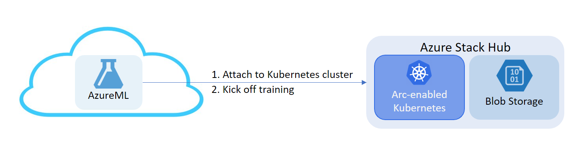

# Setup and Run AzureML Training & Inferencing Workloads On Premises Using AKS on Azure Stack HCI Via Azure Arc 

This repository is intended to serve as an information hub for AKS on Azure Stack HCI customers and partners who are interested in Arc AML training using ARC Connected Kubernetes cluster and NFS Server on Azure Stack HCI. Use this repository for onboarding and testing instructions as well as an avenue to provide feedback, issues, enhancement requests and stay up to date as the public preview progresses.

            

## Note

All features are available on a self-service, opt-in basis and are subject to breaking design and API changes. Previews are provided "as is" and "as available," and they're excluded from the service-level agreements and limited warranty. As such, these features aren't meant for production use.

## Training on Azure Stack Hub

You can use the following documents to get started with setting up your training workloads on ASH:

1. [Deploy Azure Stack Hub’s Kubernetes Cluster as a Compute Cluster in Azure Machine Learning through Azure Arc](AML-ARC-Compute.md)
2. [Setup Azure Stack Hub's Blob Storage as a Datastore on Azure Machine Learning Workspace and Run a Training Workload](Train-AzureArc.md)

## Sample Notebooks

After following the documents above, you can go through the sample notebooks linked below to get a better understanding of how the process works and the possibilities it can unlock:

* [Image Classification Using Scikit-learn](notebooks/mnist/MNIST_Training_with_ASH_Cluster_and_Storage.ipynb) (Image Classification, Aprox. 20 Minutes)

  This notebook serves as "hello world" of using Azure Stack Hub (ASH) Storage accounts and ASH clusters for training with 
  Azure Machine Learning workspaces. Estimated run time for the notebook is 20 minutes.
  
* [Distributed Image Classification with PyTorch](notebooks/distributed-cifar10/distributed-pytorch-cifar10.ipynb) (Image Classification, Aprox. 30 Minutes/Epoch)
  
  Image classification with PyTorch. The estimated run time for the notebook is 30 minutes for one epoch of training.
  
* [Distributed Image Classification with Tensorflow](notebooks/distributed-cifar10/distributed-tf2-cifar10.ipynb) (Image Classification, Aprox. 30 Minutes/Epoch)
  
  Image classification with TensorFlow, Estimated run time for the notebook is 30 minutes for one epoch of training.
  
* [Object Segmentation with Transfer Learning](notebooks/object-segmentation-on-azure-stack/object_segmentation-ash.ipynb) (Object Segmentation, Aprox. 45 Minutes/Epoch)
  
  Object segmentation using pre-trained Mask R-CNN model on PyTorch. AML pipeline steps are used for data preprocessing. The model was trained using ASH clusters and storage account. The estimated run time for the notebook is 45 minutes for one epoch of training.
  
* [AML Pipelines with NYC-TAXI-DATA](notebooks/pipeline/nyc-taxi-data-regression-model-building.ipynb) (Structured Text Data Prediction)

Note: Above run time estimated assume a vm size comparable to [Standard_DS3_v2](https://docs.microsoft.com/en-us/azure/virtual-machines/sizes-general)

## Troubleshooting

If you face issues during Setup or Training, please check our [troubleshooting guide](troubleshooting.md).
