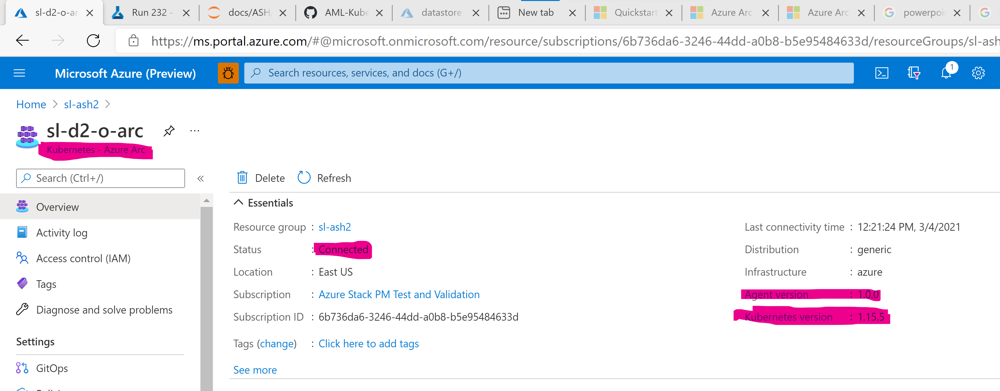

# Troubleshooting for Training Using AzureML with Azure Stack Hub Kubernetes Cluster and Storage

## Issues Related to Dataset and Datastore

1. Known limitation:
   Tabular datasets are not supported by datastore in AzureML workspace connected to ASH storage
   
2. If data cannot be uploaded to datastore, check if access the SAS token for ASH storage container hasn't expired. You can try to repeat the instruction from step 5 of [this document](Train-AzureArc.md#create-and-configure-azure-stack-hubs-storage-account).

## Attach ASH Kubernetes clusters to AzureML workspace failed
   
  * Make sure your Kubernetes cluster are connected with Azure and versions of your Kubernetes cluster 
      are [supported](https://docs.microsoft.com/en-us/azure/aks/supported-kubernetes-versions#kubernetes-version-support-policy).
Also version of Arc agent are supported should be >= 1.0.0. Please refer the following snapshot on Azure to find them:
      

      

   * Make sure latest arc extensions are installed and arc connections are created as described [here](AML-ARC-Compute.md#connect-azure-stack-hubs-kubernetes-cluster-to-azure-via-azure-arc)
   

      You may also run kubectl commands against one of the master nodes of the cluster.
      <pre> kubectl get ns </pre>
         You should see "azure-arc" is one of the namespaces.

      <pre> kubectl get pods -n azure-arc </pre>
       You should see all the pods are in "running" status
   

## AzureML Run Issues

  * No progress on AzureML experiment Runs

    For each training run, depending on RunConfiguration, one or multiple pods in default namespace may be scheduled to
   run the training job. Currently, there is a limitation that the number of pods running the training job cannot greater 
   than the number of worker nodes. Therefore, you may need to cancel the none-progressing run, and wait for other runs 
   to finish.
   
      If you do a distributed training run, you may need to reduce the node_count value in Run Configuration.
   
  * Out of memory issue

   If training job failed without obvious reasons, it may be because memories run out. Also, if training is successful 
  for one epoch but not for multiple epochs, try to increase memory.

* Bugs in your scripts
  

   These issues are relative easy to debug. You can go to AzureML run logs to check docker image creations, run time errors, 
   outputs generated by your scripts etc to pinpoint the problems. Here is a snapshot:

   

      
   

