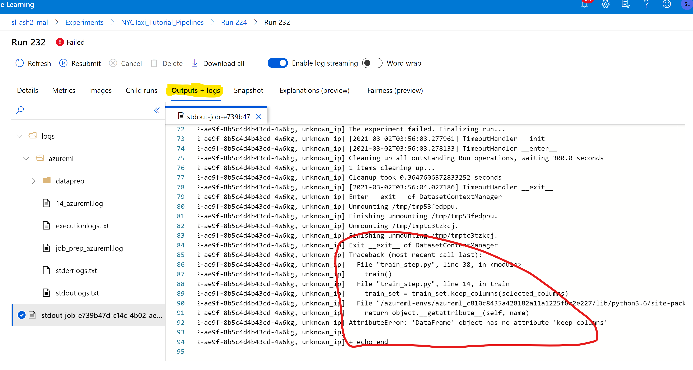

# Troubleshooting for AzureML Training on Azure Stack Hub Kubernetes Cluster and Storage

## AzureML Dataset and Datastore Issues

* Known limitations:
   
   * AML Tabular Datasets are not currenly supported on ASH blob storage
   * AML Dataset downloading is not yet stable. PLease use mounting to access your files during training
   
* If you can't access your datastore (mounting or uploading): Please check if your generated SAS token for the ASH storage container is still valid and not expired. If unsure you can try to repeat the instruction from step 5 of [this document](Train-AzureArc.md#create-and-configure-azure-stack-hubs-storage-account).

## ASH Kubernetes Cluster Related Issues

* Attaching ASH Kubernetes Cluster to AzureML Workspace Failed
   
  * Make sure your Kubernetes cluster is connected to Azure using Azure Arc. Also, make sure the version of your Kubernetes cluster is [supported](https://docs.microsoft.com/en-us/azure/aks/supported-kubernetes-versions#kubernetes-version-support-policy). Please make sure you are using the latest Arc agent according to pre-requisites of [this doc](https://github.com/Azure/azure-arc-kubernetes-preview/blob/master/docs/k8s-extensions.md#pre-requisites). You can find most of your information from the Azure portal: 
      
      

            
      

   * Please make sure the latest Arc extensions are installed and Arc connections are created as described in the pre-requisites of [this doc](https://github.com/Azure/azure-arc-kubernetes-preview/blob/master/docs/k8s-extensions.md#pre-requisites).
   

      You may also run the following kubectl commands against one of the master nodes of your cluster to check if you cluster is porperly attached to Azure via Azure Arc:
      
      <pre> kubectl get ns </pre>
      
       You should see "azure-arc" is one of the namespaces.

      <pre> kubectl get pods -n azure-arc </pre>
       You should see all the pods in "running" status.
   

## AzureML Run Issues

  * No Progress on AzureML Experiment Runs

    Currently, there is a limitation on the number of pods that can run simultaneously in a single node. There can't be more than 1 pending pod in a single node. This means that if there are more pending pods than the number of worker nodes, all the pending pods will remain pending indefinitely. As an example, if the combination of your training workloads is sending 5 pods to your Kubernetes cluster and you only have 4 worker nodes, your training pods will never get scheduled by the Kubernetes agent.  If you face this issue, please cancel all of your none-progressing runs on your AzureML workspace and retry accordingly. If you do a distributed training run, you may need to reduce the node_count value in Run Configuration.
   
  * Out of memory issue

      If your training job fails without any apparent reasons: This could be because of not having sufficient memory on your Kubernetes nodes. Insufficient Node memory could also be the reason for cases in which training is successful for only one epoch but fails for multiple epochs. Please try to either increase your Nodes' memory or optimize your training code to become less memory intensive.

* Bugs in your scripts
  

   These issues are relatively easy to debug. You can go to your AzureML Workspace to check run logs for information about environment image creations, run time errors, outputs generated by your scripts, etc. This way you can pinpoint the reason for your training workload failing. Here is a snapshot:

   

      
   

## Other Known Limitations

