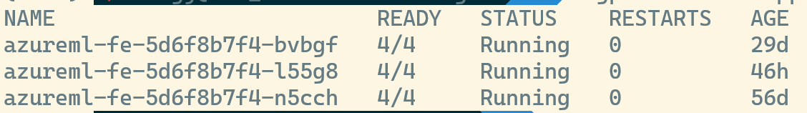

Sure, here is a possible better version of the markdown document:

# Enable training job and online endpoint in legacy AKSCompute (Preview)

## Introduction

Azure Machine Learning (AML) supports two types of Kubernetes compute targets: AKSCompute and Kubernetes compute.

AKSCompute refers to an AKS cluster that is either attached to or created within an AzureML workspace (legacy approach). Its primary function is to facilitate the deployment of models as web services exclusively, by using UI, CLI v1 or SDK v1.

On the other hand, Kubernetes compute, which is our new v2 stack, signifies a Kubernetes cluster for AKS or any Kubernetes cluster provided by on-prem or other third parties, attached to an AzureML workspace. This setup allows for the execution of both training jobs and the establishment of online endpoints for model inferencing.

Refer to this document for more details: [AKSCompute vs Kubernetes Compute](https://learn.microsoft.com/en-us/azure/machine-learning/how-to-attach-kubernetes-anywhere?view=azureml-api-2#kubernetescompute-and-legacy-akscompute)

If you possess an existing AKS cluster currently attached as a legacy AKSCompute to your AzureML workspace, you might consider utilizing it as a new Kubernetes Compute in v2 stack. This move not only allows you to gain availability to all the functionalities such as training jobs, pipeline, real-time or batch online endpoint within AzureML, but it also ensures support for all future feature updates, as well as eliminating the need to create a new cluster. This document provides a step-by-step guide to assist you in accomplishing this. The advantages of employing an existing AKSCompute as a KubernetesCompute include:

- Minimizing the cost and complexity of managing multiple clusters
- Using the identical cluster for both training and inference scenarios
- Harnessing the features and capabilities inherent in the Kubernetes v2 compute.

## Limitations
* Currently, this feature is only supported in East US and East US 2.
* Only attached AKSCompute is supported. Created AKSCompute is not supported.
* The deployment "azureml-fe" in the default namespace must have been upgraded to v2. Normally, this deployment is upgraded automatically. However, the upgrade may fail due to some reasons, such as cluster access issues or deliberate update blocking.
* The cluster must install the AzureML extension as managed cluster, instead of an Arc-Kubernetes cluster. Refer to this section for more details: [Step 2](#step-2-install-the-extension-with-extra-configuration)
* The scoring URL for AKSCompute and the scoring URL for Kubernetes compute are not segregated. This means that both deployments can access and serve the models and online deployments that are registered on either compute. This may cause some confusion or conflicts when deploying or consuming models on different computes.
* When attaching Kubernetes compute, the namespace should not be the same as the AKSCompute's namespace. Otherwise, the online deploymentes on Kubernetes compute may conflict with the webservices on AKSCompute. The namespace for v1 compute follows the pattern: `azureml-<workspace-name>`.
## Prerequisites

Before you begin, make sure you have the following:

- An AKS cluster that is already attached as an AKS v1 compute to your AML workspace.
- To check if the cluster is capable of being upgraded, run the following command to see if the "azureml-fe" deployment has been upgraded to v2:

    ```bash
    kubectl get pod -l azuremlappname=azureml-fe -l azuremlappversion=v2
    ```
    The output should indicate that pods running in v2 exist. For example:
    

## Steps

### Step 1: Add an annotation to the existing deployment

You need to add an annotation "azureml-fe-enable-upgrade"=true to the existing deployment "azureml-fe" in the default namespace. You can use the following command to add this annotation:

```bash
kubectl annotate deployment azureml-fe azureml-fe-enable-upgrade=true
```

You should see a message like this:

```bash
deployment.apps/azureml-fe annotated
```

### Step 2: Install the extension
Refer to this document for more details: [Deploy AzureML extension to your Kubernetes cluster](./deploy-extension.md)

The cluster type must be managedClusters. Do not connect the cluster to Azure Arc. The following is an example of the command:
```bash
az k8s-extension create --name <extension-name> --extension-type Microsoft.AzureML.Kubernetes --config enableTraining=True enableInference=True inferenceRouterServiceType=LoadBalancer allowInsecureConnections=True inferenceRouterHA=False --cluster-type managedClusters --cluster-name <your-AKS-cluster-name> --resource-group <your-RG-name> --scope cluster
```
### Step 3: Attach the cluster to the workspace as a Kubernetes compute

After installing the extension, you can attach the cluster to your workspace as a Kubernetes compute as normal. You can use the Azure ML CLI, the Azure ML Studio UI, or the Azure ML Python SDK to do this. For more details, you can refer to this document: [Attach Kubernetes cluster to AzureML workspace and create a compute target](./attach-compute.md)