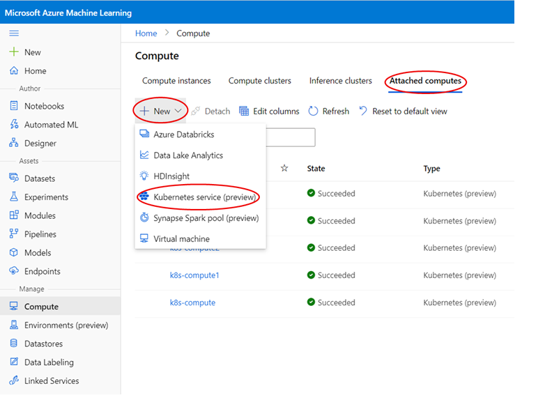
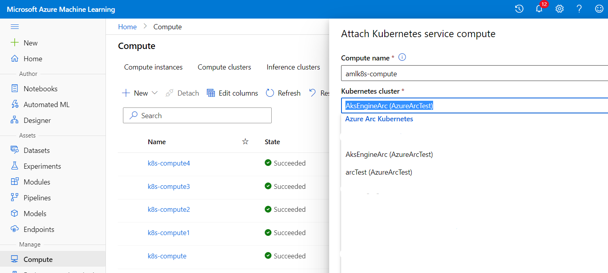
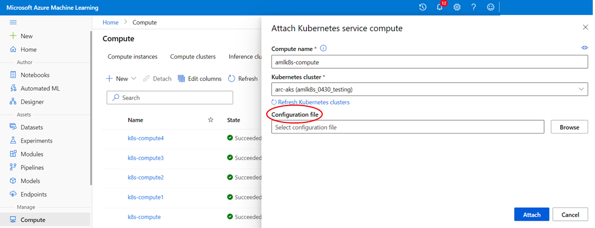
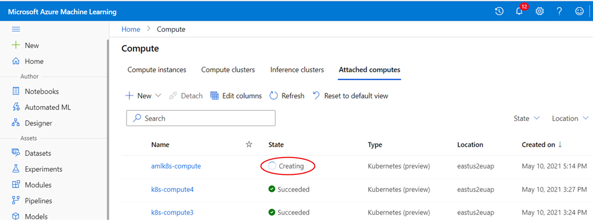

# Attach Azure Arc enabled Kubernetes cluster to AML workspace

It is easy to attach Azure Arc enabled Kuberenetes cluster to AML workspace, you can do so from AML Studio UI portal. In most cases, you can use simple attach scenario for endpoint creation and model deployment.

## Simple compute attach scenario

1. Go to AML studio portal, Compute > Attached compute, click "+New" button, and select "Kubernetes service (Preview)"

   

1. Enter a compute name, and select your Azure Arc enabled Kubernetes cluster from Azure Arc Kubernetes dropdown list.

   

1. (Optional) Browse and upload an attach config file. You can skip this step.

   

1. Click 'Attach' button. You will see the 'provisioning state' as 'Creating'. If it succeeds, you will see a 'Succeeded' state or else 'Failed' state.

   

## Advanced compute attach scenarios

AzureML Kubernetes compute target allows user to specify an attach configuration file for some advanced compute target capabilities. Following is a full example of attach configuration JSON file:

```json
{
   "namespace": "shippingDepartment",
   "defaultInstanceType": "gpu_instance",
   "instanceTypes": {
      "gpu_instance": {
         "nodeSelector": {
            "accelerator": "nvidia-tesla-k80"
         },
         "resources": {
            "requests": {
               "cpu": "2",
               "memory": "16Gi",
               "nvidia.com/gpu": "1"
            },
            "limits": {
               "cpu": "2",
               "memory": "16Gb",
               "nvidia.com/gpu": "1"
            }
         }
      },
      "big_cpu_sku": {
         "nodeSelector": {
            "VMSizes": "VM-64vCPU-256GB"
         },
         "resources": {
            "requests": {
               "cpu": "4",
               "memory": "16Gi",
               "nvidia.com/gpu": "null"
            },
            "limits": {
               "cpu": "4",
               "memory": "16Gi",
               "nvidia.com/gpu": "null"
            }
         }
      }
   }
}
```

The attach configuration JSON file allows user to specify 3 kind of custom properties for a compute target:

* ```namespace``` - Default to ```default``` namespace if this is not specified. This is the namespace where all training job will use and pods will run under this namespace. Note the namespace specified in compute target must preexist and it is usually created with Cluster Admin privilege.

* ```defaultInstanceType``` - You must specify a ```defaultInstanceType``` if you specify ```instanceTypes``` property, and the value of ```defaultInstanceType``` must be one of values from ```instanceTypes``` property.

* ```instanceTypes``` - This is the list of instance_types to be used for running training job. Each instance_type is defined by ```nodeSelector``` and ```resources requests/limits``` properties:

  * ```nodeSelector``` - one or more node labels. Cluster Admin privilege is needed to create labels for cluster nodes. If this is specified, training job will be scheduled to run on nodes with the specified node labels. You can use ```nodeSelector``` to target a subset of nodes for training workload placement. This can be very handy if a cluster has different SKUs, or different type of nodes such as CPU or GPU nodes, and you want to target certain nodes for training workload.

  * ```Resources requests/limits``` - ```Resources requests/limits``` specifies resources requests and limits a training job pod to run.

* **Note**: Training public preview only supports job submission using by specifying compute target name only, thus it will always use ```defaultInstanceType``` to run training workload. Support for training job submission with compute target name and instance_type name will come after public preview release.

```
