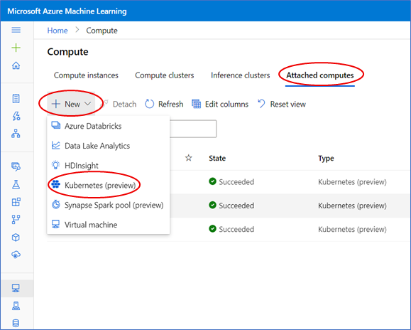
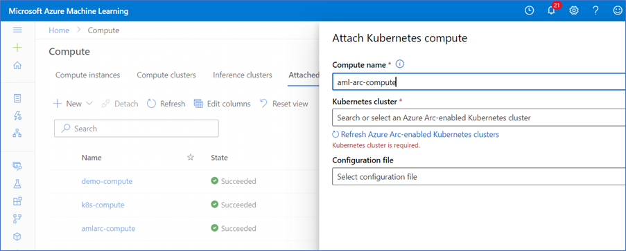
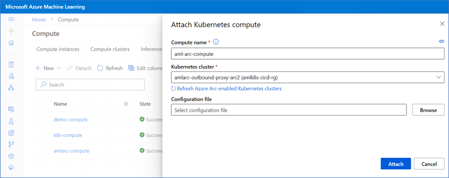
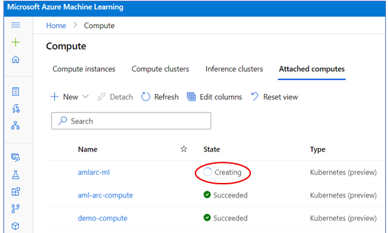

# Attach Azure Arc-enabled Kubernetes cluster to AML workspace

It is easy to attach Azure Arc enabled Kuberenetes cluster to AML workspace, you can do so from AML Studio UI portal. In most cases, you can use simple attach scenario for endpoint creation and model deployment.

## Simple compute attach scenario

1. Go to AML studio portal, Compute > Attached compute, click "+New" button, and select "Kubernetes (Preview)"

   

1. Enter a compute name, and select your Azure Arc-enabled Kubernetes cluster from Azure Arc-enabled Kubernetes cluster dropdown list.

   

1. (Optional) Browse and upload an attach config file. The step is optional and the simple attach scenario will skip this.

   

1. Click 'Attach' button. You will see the 'provisioning state' as 'Creating'. If it succeeds, you will see a 'Succeeded' state or else 'Failed' state.

   

## Advanced compute attach scenarios

AzureML Kubernetes compute target allows user to specify an attach configuration file for some advanced compute target capabilities. Following is a full example of attach configuration JSON file:

```json
{
   "namespace": "amlarc-testing",
   "defaultInstanceType": "gpu_instance",
   "instanceTypes": {
      "gpu_instance": {
         "nodeSelector": {
            "accelerator": "nvidia-tesla-k80"
         },
         "resources": {
            "requests": {
               "cpu": "2",
               "memory": "16Gi",
               "nvidia.com/gpu": "1"
            },
            "limits": {
               "cpu": "2",
               "memory": "16Gi",
               "nvidia.com/gpu": "1"
            }
         }
      },
      "big_cpu_sku": {
         "nodeSelector": {
            "VMSizes": "VM-64vCPU-256GB"
         },
         "resources": {
            "requests": {
               "cpu": "4",
               "memory": "16Gi",
               "nvidia.com/gpu": "0"
            },
            "limits": {
               "cpu": "4",
               "memory": "16Gi",
               "nvidia.com/gpu": "0"
            }
         }
      }
   }
}
```

The attach configuration JSON file allows user to specify 3 kind of custom properties for a compute target:

* ```namespace``` - Default to ```default``` namespace if this is not specified. This is the namespace where all training job will use and pods will run under this namespace. Note the namespace specified in compute target must preexist and it is usually created with Cluster Admin privilege.

* ```defaultInstanceType``` - You must specify a ```defaultInstanceType``` if you specify ```instanceTypes``` property, and the value of ```defaultInstanceType``` must be one of values from ```instanceTypes``` property.

* ```instanceTypes``` - This is the list of instance_types to be used for running training job. Each instance_type is defined by ```nodeSelector``` and ```resources requests/limits``` properties:

  * ```nodeSelector``` - one or more node labels. Cluster Admin privilege is needed to create labels for cluster nodes. If this is specified, training job will be scheduled to run on nodes with the specified node labels. You can use ```nodeSelector``` to target a subset of nodes for training workload placement. This can be very handy if a cluster has different SKUs, or different type of nodes such as CPU or GPU nodes, and you want to target certain node pool for training workload. For examples, you could create node labels for all GPU nodes and define an instanceType for GPU node pool, in this way you will be able to submit training job to that GPU node pool.

  * ```Resources requests/limits``` - ```Resources requests/limits``` specifies resources requests and limits a training job pod to run.

**Note**: Training public preview only supports job submission using compute target name only, thus it will always use ```defaultInstanceType``` to run training workload. Support for training job submission with compute target name and instance_type name will come after public preview release.

**Note**: For simple compute attach without specifying resources requests/limits, AzureML will create below resources requests/limits for training job. To ensure successful job run completion, we recommend to always specify resources requests/limits according to training job needs.

```json
{
   "namespace": "default",
   "defaultInstanceType": "defaultInstanceType",
   "instanceTypes": {
      "defaultInstanceType": {
         "nodeSelector": "null",
         "resources": {
            "requests": {
               "cpu": "1",
               "memory": "4Gi",
               "nvidia.com/gpu": "0"
            },
            "limits": {
               "cpu": "1",
               "memory": "4Gi",
               "nvidia.com/gpu": "0"
            }
         }
      }
   }
}
```

## Attach compute and create compute target via AML Python SDK (version >=1.30)

You can also attach Arc cluster and create KubernetesCompute target easily via AML Python SDK 1.30 or above.

### Simple compute attach scenario with default compute resources requests/limits

Following Python code snippets shows how you can easily attach an Arc cluster and create a compute target to be used for training job.

```python
from azureml.core.compute import KubernetesCompute
from azureml.core.compute import ComputeTarget
import os

ws = Workspace.from_config()

# choose a name for your Azure Arc-enabled Kubernetes compute
amlarc_compute_name = os.environ.get("AML_COMPUTE_CLUSTER_NAME", "amlarc-compute")

# resource ID for your Azure Arc-enabled Kubernetes cluster
resource_id = "/subscriptions/123/resourceGroups/rg/providers/Microsoft.Kubernetes/connectedClusters/amlarc-cluster"

if amlarc_compute_name in ws.compute_targets:
    compute_target = ws.compute_targets[amlarc_compute_name]
    if compute_target and type(compute_target) is KubernetesCompute:
        print("found compute target: " + amlarc_compute_name)
else:
    print("creating new compute target...")

    amlarc_attach_configuration = KubernetesCompute.attach_configuration(resource_id) 
    amlarc_compute = ComputeTarget.attach(ws, amlarc_compute_name, amlarc_attach_configuration)

 
    amlarc_compute.wait_for_completion(show_output=True)
    
     # For a more detailed view of current KubernetesCompute status, use get_status()
    print(amlarc_compute.get_status().serialize())
```

### Advanced compute attach scenario with list of instanceTypes

You can also create a compute target with a list of instanceTypes, including custom properties like namespace, nodeSelector, or resources requests/limits. Following Python code snippet shows how to accomplish this.

```python
from azureml.core.compute import KubernetesCompute
from azureml.core.compute import ComputeTarget
import os

ws = Workspace.from_config()

# choose a name for your Azure Arc-enabled Kubernetes compute
amlarc_compute_name = os.environ.get("AML_COMPUTE_CLUSTER_NAME", "amlarc-compute")

# resource ID for your Azure Arc-enabled Kubernetes cluster
resource_id = "/subscriptions/123/resourceGroups/rg/providers/Microsoft.Kubernetes/connectedClusters/amlarc-cluster"

if amlarc_compute_name in ws.compute_targets:
   compute_target = ws.compute_targets[amlarc_compute_name]
   if compute_target and type(compute_target) is KubernetesCompute:
      print("found compute target: " + amlarc_compute_name)
else:
   print("creating new compute target...")
   ns = "amlarc-testing"
    
   instance_types = {
      "gpu_instance": {
         "nodeSelector": {
            "accelerator": "nvidia-tesla-k80"
         },
         "resources": {
            "requests": {
               "cpu": "2",
               "memory": "16Gi",
               "nvidia.com/gpu": "1"
            },
            "limits": {
               "cpu": "2",
               "memory": "16Gi",
               "nvidia.com/gpu": "1"
            }
        }
      },
      "big_cpu_sku": {
         "nodeSelector": {
            "VMSizes": "VM-64vCPU-256GB"
         }
      }
   }

   amlarc_attach_configuration = KubernetesCompute.attach_configuration(resource_id = resource_id, namespace = ns, default_instance_type="gpu_instance", instance_types = instance_types)
 
   amlarc_compute = ComputeTarget.attach(ws, amlarc_compute_name, amlarc_attach_configuration)

 
   amlarc_compute.wait_for_completion(show_output=True)
    
   # For a more detailed view of current KubernetesCompute status, use get_status()
   print(amlarc_compute.get_status().serialize())
```