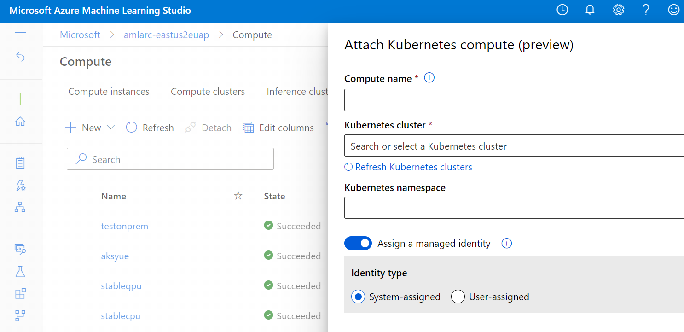

# Create a compute target - attach AKS or Arc cluster to AML workspace

## Pre-requisite

Azure Machine Learning workspace defaults to have a system-assigned managed identity to access Azure ML resources. The steps are completed if the system assigned default setting is on. 


Otherwise, if a user-assigned managed identity is specified in Azure Machine Learning workspace creation, the following role assignments need to be granted to the managed identity manually before attaching the compute.

|Azure resource name |Role to be assigned|Description|
|--|--|--|
|Azure Relay|Azure Relay Owner|Only applicable for Arc-enabled Kubernetes cluster. Azure Relay is not created for AKS cluster without Arc connected.|
|Azure Arc-enabled Kubernetes|Reader|Applicable for both Arc-enabled Kubernetes cluster and AKS cluster.|

Azure Relay resource is created during the extension deployment under the same Resource Group as the Arc-enabled Kubernetes cluster.

## Create compute target via Azure ML 2.0 CLI

You can attach AKS or Arc cluster and create KubernetesCompute target easily via AzureML 2.0 CLI.

1. Refer to [Install, set up, and use the 2.0 CLI (preview)](https://docs.microsoft.com/en-us/azure/machine-learning/how-to-configure-cli) to install ML 2.0 CLI. Compute attach support **requires ml extension >= 2.0.1a4**. 

1. Attach the  Arc-enabled Kubernetes cluster,

```azurecli
az ml compute attach --resource-group
                     --workspace-name
                     --name
                     --resource-id
                     --type					 
                     [--namespace]
                     [--identity-type]
                     [--user-assigned-identities]
                     [--no-wait]

```

**Required Parameters**

* `--resource-group -g` 

   Name of resource group. You can configure the default group using `az configure --defaults group=<name>`.
* `--workspace-name -w` 
   
   Name of the Azure ML workspace. You can configure the default group using `az configure --defaults workspace=<name>`.
* `--name -n`

   Name of the compute target.
* `--resource-id`

   The fully qualified ID of the resource, including the resource name and resource type.
   
   For Arc-enabld k8s cluster, it's like ` /subscriptions/<sub ID>/resourceGroups/<resource group>/providers/Microsoft.Kubernetes/connectedClusters/<cluster name>"`

   For AKS cluster with ML extension deployed without Arc conntected, it's like ` "/subscriptions/<sub ID>/resourceGroups/<resource group>/providers/Microsoft.ContainerService/managedclusters/<cluster name>`
* `--type -t`

   The type of compute target. Allowed values: kubernetes, virtualmachine. Specify `kubernetes` to attach arc-enabled kubernetes cluster or AKS cluster with ML extension deployed.

**Optional Parameters**

* `--namespace`

   Kubernetes namespace to host the ML workloads at this compute, default to `default`.
* `--no-wait`

   Do not wait for the long-running operation to finish.
* `--identity-type`

   The type of managed identity. Allowed values: SystemAssigned, UserAssigned.
* `--user-assigned-identities`
 
   Only needed when user assigned identity is used. A list of resource IDs separated by commas. Only the first identity in the list can be used today.

## Create a compute target via AML Studio UI

It is easy to attach Azure Arc-enabled Kubernetes cluster to AML workspace, you can do so from AML Studio UI portal. 


1. Go to AML studio portal > Compute > Attached compute, click "+New" button, and select "Kubernetes (Preview)"

   

1. Enter a compute name, and select your AKS or Azure Arc-enabled Kubernetes cluster from Kubernetes cluster dropdown list.

   


   * (Optional) Assign system-assigned or user-assigned [Managed Identity](https://docs.microsoft.com/en-us/azure/active-directory/managed-identities-azure-resources/overview).


1. Click 'Attach' button. You will see the 'provisioning state' as 'Creating'. If it succeeds, you will see a 'Succeeded' state or else 'Failed' state.

   


## Create compute target via Python

You can also attach AKS or Arc cluster and create KubernetesCompute target easily via AML Python SDK v1 1.30 or above.

Following Python code snippets shows how you can easily attach an kubernetes cluster and create a compute target with Managed Identity enabled.


```python
from azureml.core.compute import KubernetesCompute, ComputeTarget

# Specify a name for your Kubernetes compute
compute_target_name = "<kubernetes compute target name>"

# resource ID of the Arc-enabled Kubernetes cluster
cluster_resource_id = "/subscriptions/<sub ID>/resourceGroups/<RG>/providers/Microsoft.Kubernetes/connectedClusters/<cluster name>"

user_assigned_identity_resouce_id = ['subscriptions/<sub ID>/resourceGroups/<RG>/providers/Microsoft.ManagedIdentity/userAssignedIdentities/<identity name>']

# Specify Kubernetes namespace to run AzureML workloads
ns = "default" 

try:
    compute_target = ComputeTarget(workspace=ws, name=compute_target_name)
    print('Found existing cluster, use it.')
except ComputeTargetException:
    attach_configuration = KubernetesCompute.attach_configuration(resource_id = cluster_resource_id, namespace = ns,  identity_type ='UserAssigned',identity_ids = user_assigned_identity_resouce_id)
    compute_target = ComputeTarget.attach(ws, compute_target_name, attach_configuration)
    compute_target.wait_for_completion(show_output=True)
```

**Parameters of `KubernetesCompute.attach_configuration()`**

`resource_id`, [string](https://docs.python.org/3/library/string.html#module-string), required

  The fully qualified ID of the resource, including the resource name and resource type.

`namespace`, [string](https://docs.python.org/3/library/string.html#module-string), optional

Kubernetes namespace to host the ML workloads at this compute, default to `default`.

`identity_type`, [string](https://docs.python.org/3/library/string.html#module-string), optional

default value: None

Possible values are:

- SystemAssigned - System assigned identity

- UserAssigned - User assigned identity. Requires identity_ids to be set.

`identity_ids`, [list](https://docs.python.org/3/library/stdtypes.html#list)[[str](https://docs.python.org/3/library/string.html#module-string)], optional

default value: None

List of resource ids for the user assigned identity. e.g. ['subscriptions/\<sub ID>/resourceGroups/\<RG>/providers/Microsoft.ManagedIdentity/userAssignedIdentities/\<identity name>']

## Next Step
- [Create and select different instance types for training and inferencing workloads](./instance-type.md)
- [Update Managed Identity and Assign roles to Managed Identity](./managed-identity.md)
