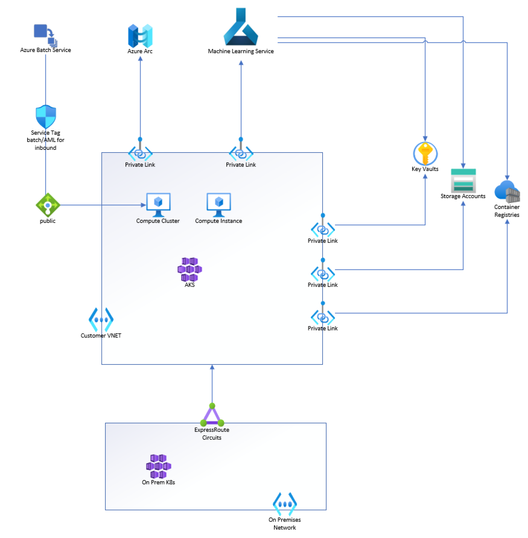

# AMLArc with AzureCNI AKS cluster and Private Link AML Workspace

Using an AMLArc enabled AzureCNI AKS cluster for compute in a workspace allow s for further security and does not require too much more setup than a publicly exposed cluster and workspace.

### Required public internet access

Azure Machine Learning requires both inbound and outbound access to the public internet. Documentation for inbound and outbound access is provided here: https://docs.microsoft.com/en-us/azure/machine-learning/how-to-secure-workspace-vnet?tabs=pe#required-public-internet-access

### Network flow:

Here is a graph to show network flow:

### Setting up VNET:

The Azure VNET can be created independently or during the creation of the AKS cluster explained in the next section.

The VNET does need to have a sufficiently  large address space, The default address space of 10.0.0.0/16 has worked in our testing. The subnet also needs to be large enough to accommodate the AKS cluster, In general, you'll want 128 addresses per node in your cluster, if using default settings. More documentation on creating an Azure VNET can be found here:
https://docs.microsoft.com/en-us/azure/virtual-network/quick-create-portal.

Make sure your user account must have permissions to the following actions in Azure role-based access control (Azure RBAC):

- "Microsoft.Network/virtualNetworks/join/action" on the virtual network resource.
- "Microsoft.Network/virtualNetworks/subnet/join/action" on the subnet resource.

### Setting up AKS cluster:

Setting up your AKS cluster with Azure CNI is documented here:
https://docs.microsoft.com/en-us/azure/aks/configure-azure-cni

As mentioned in the VNET setup section of this document the VNET being used can either be created independently or during setup of the AKS cluster through the portal. The portal has the added convenience of making sure your subnet is large enough for your cluster.

A private aks cluster uses an internal IP address to ensure that network traffic between the API server and node pools remains on a private network only.You can enable private aks in portal or [az aks cli](https://docs.microsoft.com/en-us/azure/aks/private-clusters#create-a-private-aks-cluster)

### Installing AMLArc:

All instructions for connecting to an AKS AzureCNI cluster are the same as a public AKS cluster:
https://docs.microsoft.com/en-us/azure/machine-learning/how-to-attach-arc-kubernetes

Do take note however that all commands must be run from a VM within the VNET to be able to communicate and install the Arc and AMLArc extensions on the cluster.

### Setting up AzureML Workspace:

Private link workspace are required if using an AzureCNI cluster and if the user wants to secure their connection to workspace.
Documentation for a private link workspace is provided here:
https://docs.microsoft.com/en-us/azure/machine-learning/how-to-configure-private-link?tabs=python

Notably, if one wants to access the workspace studio one has to either enable public access to the cluster explained in document above, or follow this documentation: https://docs.microsoft.com/en-us/azure/machine-learning/how-to-enable-studio-virtual-network.

### Setting up Azure Storage Account

Azure Machine Learning supports storage accounts configured to use either a private endpoint or service endpoint. Documentation for a private link storage account is provided here: https://docs.microsoft.com/en-us/azure/machine-learning/how-to-secure-workspace-vnet?tabs=pe#secure-azure-storage-accounts

### Setting up Azure Key Vault

Azure Machine Learning uses an associated Key Vault instance to store the following credentials:

- The associated storage account connection string
- Passwords to Azure Container Repository instances
- Connection strings to data stores

Documentation for a private link key vault is provided here: https://docs.microsoft.com/en-us/azure/machine-learning/how-to-secure-workspace-vnet?tabs=pe#secure-azure-key-vault

### Setting up Azure Container Registry

Azure Machine Learning uses Azure Container Registry to store customers image. Documentation for a private link container registry is provided here: https://docs.microsoft.com/en-us/azure/container-registry/container-registry-private-link#set-up-private-endpoint---portal-recommended. 

Configure compute cluster for building image in your vnet. https://docs.microsoft.com/en-us/azure/machine-learning/how-to-secure-workspace-vnet?tabs=pe#enable-azure-container-registry-acr
