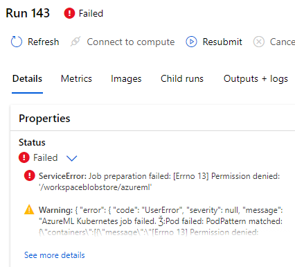
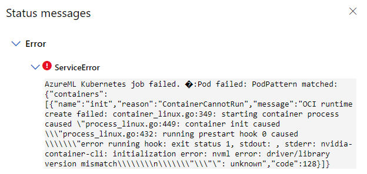

# Job is pending for a long time

## Check the resource capacity of the nodes:

``` azure cli
kubectl get nodes -o json | jq '.items[]|{name: .metadata.name, capacity: .status.capacity, allocatable: .status.allocatable}'
```

Here is a sample output

``` azure cli
{
  "name": "aks-nodepool1-36994511-vmss000000",
  "capacity": {
    "attachable-volumes-azure-disk": "24",
    "cpu": "6",
    "ephemeral-storage": "129900528Ki",
    "github.com/fuse": "1k",
    "hugepages-1Gi": "0",
    "hugepages-2Mi": "0",
    "memory": "57584828Ki",
    "nvidia.com/gpu": "1",
    "pods": "110"
  },
  "allocatable": {
    "attachable-volumes-azure-disk": "24",
    "cpu": "5840m",
    "ephemeral-storage": "119716326407",
    "github.com/fuse": "1k",
    "hugepages-1Gi": "0",
    "hugepages-2Mi": "0",
    "memory": "51573948Ki",
    "nvidia.com/gpu": "1",
    "pods": "110"
  }
}
```

## Insufficient github.com/fuse

Check whether k8s-host-device-plugin-daemonset is installed properly.

``` azure cli
kubectl get ds -A | grep k8s-host-device-plugin-daemonset
```

## Insufficient nvidia.com/gpu

Check whether nvidia-device-plugin-daemonset is installed properly. For more details, please refer to [k8s-device-plugin](https://github.com/NVIDIA/k8s-device-plugin)

``` azure cli
kubectl get ds -A | grep nvidia-device-plugin-daemonset
```

## The "ps-0" pod is stuck in pending status

``` azure cli
kubectl get pods | grep ps-0
```

Please try using another instance-type of lower resource requested.

## blobfuse fails to mount

Make sure the [blobfuse-flexvolume-installer](https://github.com/Azure/kubernetes-volume-drivers/tree/master/flexvolume#config-kubelet-service-to-enable-flexvolume-driver) daemonset is installed properly

## no volume plugin matched

``` error message
Warning  FailedMount xxx  kubelet  xxxx: failed to get Plugin from volumeSpec for volume "f38a008f5870bd913f36e68c12dc1827-blobfuse-0" err=no volume plugin matched
```

This error message indicates that the flexvol is not installed properly.

Try changing the installation path for the volume plugin

``` azure cli
az k8s-extension create  -g <resource group> -c <cluster> --cluster-type connectedClusters  --extension-type Microsoft.AzureML.Kubernetes -n trainingcompute --release-train stable --config enableTraining=true  --configuration-settings volumePluginDir=/usr/libexec/kubernetes/kubelet-plugins/volume/exec/
```

# Job is in failed status

## OOM Error (Out of Memory)

Please try adjusting the batch size of the training job or using an instance-type with higher memory limit. For tensorflow jobs, unlike other distributed jobs set the memory limits of ps pod hard coded with 2048Mi, the memory limit of ps pods are the same as the worker nodes'.

## Permission Denied under '/workspaceblobstore/azureml'



Please upgrade the blobfuse on the kubernetes nodes to 1.3.6 or above.

``` azure cli
az k8s-extension create  -g <resource group> -c <cluster> --cluster-type connectedClusters  --extension-type Microsoft.AzureML.Kubernetes -n trainingcompute --release-train stable --config enableTraining=true  blobfuseSysctlInstall.enabled=true
```

## stderr: nvidia-container-cli: initialization error: nvml error: driver/library version mismatch



1. Try restarting the problematic node.

2. Check whether [nvml driver library version mismatch](https://stackoverflow.com/questions/43022843/nvidia-nvml-driver-library-version-mismatch)


## Job failed with blobfuse using SasToken

It may be due to an outdated CRD of the aml-operator, please update the CRD in the cluster. 


## x509: certificate signed by unknown authority

It may be due to cluster is configured with an outbound proxy with self-signed certificate but arc extension doesn't trust the certificate. Please follow the [guidance to provide and trust proxy-cert when connect cluster to Azure Arc](https://docs.microsoft.com/en-us/azure/azure-arc/kubernetes/quickstart-connect-cluster?tabs=azure-cli#4a-connect-using-an-outbound-proxy-server)

## UserError: Unable to mount data store workspaceblobstore. Give either an account key or SAS token.
Credential less storage blob is not supported right now for training jobs. 

## UserError: Failed to acquire CSI storage account credentials
Error message is:
AzureML Kubernetes job failed. 400:{"Msg":"Failed to acquire CSI storage account credentials for mountVolume 'hbiws8397576437-2e2dc25af77dcceea86ae50b45bd1724-secrets', encountered an error: Encountered an error when attempting to connect to Storage Account 'hbiws8397576437': HTTP 403 Forbidden: {\"error\":{\"code\":\"AuthorizationFailed\",\"message\":\"The client '1d0028bc-c1ca-4bdc-8bc0-e5e19cc6f812' with object id '1d0028bc-c1ca-4bdc-8bc0-e5e19cc6f812' does not have authorization to perform action 'Microsoft.Storage/storageAccounts/listKeys/action' over scope '/subscriptions/4aaa645c-5ae2-4ae9-a17a-84b9023bc56a/resourceGroups/youhuaprivatelink/providers/Microsoft.Storage/storageAccounts/hbiws8397576437' or the scope is invalid. If access was recently granted, please refresh your credentials.\"}}","Code":400}

Assign system assigned managed identity of the attached compute the access of (“Storage Blob Data Contributor”) and Storage Account Contributor” to the storage account by following [this](https://github.com/Azure/AML-Kubernetes/blob/master/docs/managed-identity.md).

## UserError: Failed to acquire CSI storage account credentials
Error message is:
AzureML Kubernetes job failed. 400:{"Msg":"Failed to acquire CSI storage account credentials for mountVolume 'hbipleusws6182689148-c8d2ee5daca188bde53fa0711010c53c-secrets', encountered an error: Encountered an error when attempting to connect to Storage Account 'hbipleusws6182689148': Failed to successfully make an http request after 10 attempts. Last inner exception: %!w(\u003cnil\u003e)","Code":400}

Please follow [Private Link troubleshooting section](https://github.com/Azure/AML-Kubernetes/blob/master/docs/private-link.md) to check your network settings.

## UserError: Unable to upload project files to working directory in AzureBlob because the authorization failed
Error message is:
Unable to upload project files to working directory in AzureBlob because the authorization failed. Most probable reasons are:
 1. The storage account could be in a Virtual Network. To enable Virtual Network in Azure Machine Learning, please refer to https://docs.microsoft.com/en-us/azure/machine-learning/service/how-to-enable-virtual-network.

Please make sure the storage account has enabled the exceptions of “Allow Azure services on the trusted service list to access this storge account” and the aml workspace is in the resource instances list. And make sure the aml workspace has system assigned managed identity. 

## UserError: Encountered an error when attempting to connect to the Azure ML token service
Error message is:
AzureML Kubernetes job failed. 400:{"Msg":"Encountered an error when attempting to connect to the Azure ML token service","Code":400}

It should be network issue. Please follow [Private Link troubleshooting section](https://github.com/Azure/AML-Kubernetes/blob/master/docs/private-link.md) to check your network settings. 

## ServiceError: AzureML Kubernetes job failed
Error message is:
AzureML Kubernetes job failed. 137:PodPattern matched: {"containers":[{"name":"training-identity-sidecar","message":"Updating certificates in /etc/ssl/certs...\n1 added, 0 removed; done.\nRunning hooks in /etc/ca-certificates/update.d...\ndone.\n * Serving Flask app 'msi-endpoint-server' (lazy loading)\n * Environment: production\n   WARNING: This is a development server. Do not use it in a production deployment.\n   Use a production WSGI server instead.\n * Debug mode: off\n * Running on http://127.0.0.1:12342/ (Press CTRL+C to quit)\n","code":137}]}

Check your proxy setting and check whether 127.0.0.1 was added to proxy-skip-range when using “az connectedk8s connect” by following [this](https://github.com/Azure/AML-Kubernetes/blob/master/docs/network-requirements.md). 

