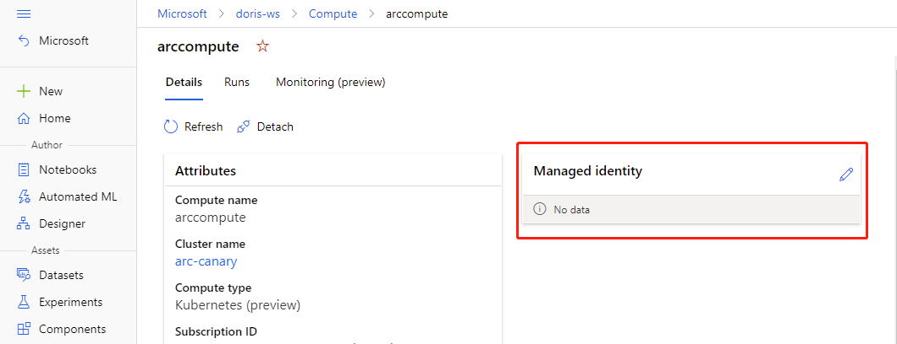
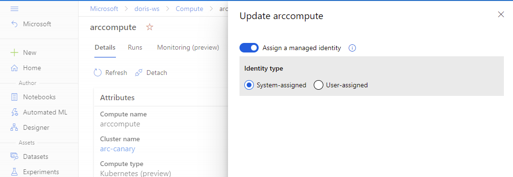
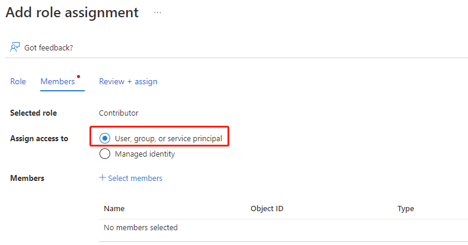

# Assign Managed Identity to the compute target

A common challenge for developers is the management of secrets and credentials used to secure communication between different components making up a solution. [Managed Identity](https://docs.microsoft.com/en-us/azure/active-directory/managed-identities-azure-resources/overview) eliminate the need for developers to manage credentials.

To access Azure Container Registry (ACR) for Docker image, and Storage Account for trainig data, attach AMLArc compute with system-assigned or user-assigned managed identity enabled.

## Assign Managed Identity 

- You can assign Managed Identity to the compute in [compute attach](./attach-compute.md)
- If the compute has been attached, you can update the settings of Managed Identity in Machine Learning Studio.
  - Go to Azure Machine Learning Studio - Compute - Attached compute, select your attached compute.
  - Edit Managed Identity.
   
   

## Assign Azure roles to Managed Identity

Azure offers a couple of ways to assign roles to Managed Identity.
- [Use Azure Portal to assign roles](https://docs.microsoft.com/en-us/azure/role-based-access-control/role-assignments-portal?tabs=current).
- [Use CLI to assign roles](https://docs.microsoft.com/en-us/azure/role-based-access-control/role-assignments-cli)
- [Use PowerShell to assign roles](https://docs.microsoft.com/en-us/azure/role-based-access-control/role-assignments-powershell)

>If use Portal to assign roles, and you have system-assigned managed identity, select **User,group,or service principal**. Click Select members, find and search the identity name formatted as ``\<workspace name>/computes/\<compute target name>``
>
> If you have user-assigned managed identity, select **Managed identity** to find the target identity. 
   
   
   ### Use Managed Identity to pull image from Azure Container Registry
   
   "AcrPull" role shoule be granted to the compute Managed Identity.
   
   ### Use Managed Identity to access Azure Blob
   
-	For read-only purpose, `Storage Blob Data Reader` role should be granted to the compute Managed Identity.
-	For read-write purpose, `Storage Blob Data Contributor` role should be granted to the compute Managed Identity.
