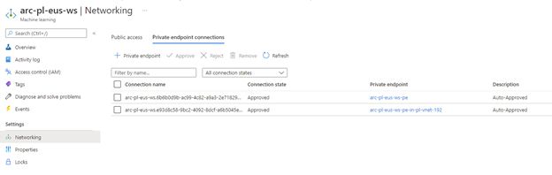
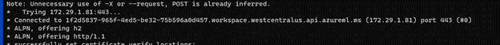

# Use Azure Private Link to securely access Azure services

Azure Private Link enables you to access Azure PaaS Services (for example, Azure Storage and SQL Database) and Azure hosted customer-owned/partner services over a Private Endpoint in your virtual network. Traffic between your virtual network and the service traverses over the Microsoft backbone network, eliminating exposure from the public Internet. 

In AzureML extension scenario, AzureML extension was installed into the cluster, we use Machine Learning service to submit or cancel jobs to the cluster and for jobs updating job metadata to AML service. When training jobs or inference deployment runs, we will need to use the Machine learning workspace default Container registries, Storage accounts and key vaults. Relay and Service Bus is used by AzureML extension for communication between AML service and the cluster. All these services could be connected to the customer VNet by private endpoint. When private link for Machine Learning Service is used, if you disable the public access for Container registries and also want to use the AML’s build service to build the image, compute cluster is needed for AML’s image build when Machine Learning Service is in VNet. 

Below is the network architecture for AKS:

For AKS scenario, Customer VNet should be the AKS’s VNet. In this scenario, customer could submit training jobs and inference deployment in private AKS cluster with Azure CNI with private endpoints from below services:
- Machine Learning workspace, 
- Workspace default storage account
- Workspace default keyvaults
- Workspace default ACRs

Below is the network architecture for on premise cluster: 

For on premise scenario, you could use an outbound proxy and connect the proxy to the Azure VNet by using Expressroute or VPN connection.  In this scenario, you could submit training jobs and inference deployment in on premise cluster with outbound proxy which is in the same VNet with private endpoints (connect by VPN or expressRoute) with private endpoints from below services:
- Machine Learning workspace
- Workspace default storage account
- Workspace default keyvaults
- Workspace default ACRs

Notice: For the VPN or expressRoute, please remember to config the related DNS setting for the private endpoint for workspace URL, storage account URL, container registries URL and Keyvault URLs. You could get the IP address from DNS configuration for related service which has private endpoints enabled. Below is the how to get the DNS setting for private endpoints from machine learning workspace.  

Below is the example for DNS setting for private endpoints from machine learning workspace, storage account and ACR.  
192.168.1.4 133b5a62-9724-4ab0-a273-f2d586e4676d.workspace.eastus.api.azureml.ms  
192.168.1.6 arcpleusws3240447895.blob.core.windows.net  
192.168.1.7 arcpleusws3240447895.file.core.windows.net  
192.168.1.8 arcpleusws3240447895.queue.core.windows.net  
192.168.1.9 arcpleusws3240447895.table.core.windows.net  
192.168.1.12 acrpleusws.azurecr.io

## Configurations
### Virtual Network
The Azure virtual network (VNet) can be created independently or during the creation of the AKS cluster explained if you use AKS cluster.
The VNet does need to have a sufficiently large address space, The default address space of 10.0.0.0/16 has worked in our testing. The subnet also needs to be large enough to accommodate the AKS cluster. In general, you'll want 128 addresses per node in your cluster, if using default settings. More documentation on creating an Azure VNet can be found [here](https://docs.microsoft.com/en-us/azure/virtual-network/quick-create-portal).

### AKS cluster
Setting up your AKS cluster with Azure CNI is documented [here](https://docs.microsoft.com/en-us/azure/aks/configure-azure-cni).
A private AKS cluster uses an internal IP address to ensure that network traffic between the API server and node pools remains on a private network only. You can enable private AKS in portal or az aks cli.

For AKS with network type Kubenet, you could find the VNet name under the resource group of MC_[rg_name]_[aks_name]_[region]. You could create the private endpoint in this VNet if you want to use the private link.

### Azure Arc
You can follow [this doc](https://github.com/Azure/azure-arc-kubernetes-preview/blob/master/docs/private-links-for-kubernetes-clusters-preview.md) to create private endpoints for Azure Arc services and then install AzureML extension on the Azure Arc. For AzureML extension scenario, Azure Arc is used to install or upgrade the extension. When running training or inference jobs, Azure Arc service is not used. 

### AzureML extension installation
All instructions for connecting to an AKS AzureCNI cluster are the same as a public AKS cluster at [here](https://docs.microsoft.com/en-us/azure/machine-learning/how-to-attach-arc-kubernetes).
Do take note however that all commands must be run from a VM within the VNet to be able to communicate and install the Arc and AzureML extensions on the cluster.

### Azure Machine Learning

Machine learning could be set to public network access disabled and added related private endpoints. Please use System managed identity when creating machine learning workspace. When using user managed identity, if you use storage account with private link, the workspace will have problem accessing the storage account since trusted service only allows system managed identities. 
When using HBI workspace, when attaching the compute, please assign a system-assigned managed identity for the compute. And then assign managed identity the access of (“Storage Blob Data Contributor”) and Storage Account Contributor” to the storage account by following [this](https://github.com/Azure/AML-Kubernetes/blob/master/docs/managed-identity.md).

 
Below chart is about disable public network access for Machine Learning:

 
Below chart is how you could check your private endpoint connections. Multiple private endpoints could be added if workspace needs to connect to different VNets.

 
If you enabled private endpoints for Machine Learning, you need to add compute cluster. Before adding compute cluster, similar network security group from below chart needs to be added. To configure the workspace to build Docker images using the compute cluster, you could follow the doc [here](https://docs.microsoft.com/en-us/azure/machine-learning/how-to-secure-workspace-vnet?tabs=pe%2Ccli#enable-azure-container-registry-acr).

 
More documentation for a private link workspace is provided [here](https://docs.microsoft.com/en-us/azure/machine-learning/how-to-configure-private-link?tabs=python).
Please note that if you want to access the workspace studio you have to either enable public access to the cluster explained in document above, or follow this [documentation](https://docs.microsoft.com/en-us/azure/machine-learning/how-to-enable-studio-virtual-network).

### Azure storage account
•	To secure the storage account created by workspace, following this link to set create the private endpoints for  Blob, File, Table and Queue. Set the firewall and virtual networks as follows:

 
 “Allow Azure services on the trusted services list to access this storage account” should be enabled and Microsoft.MachineLearningServices/workspaces Resource type with related workspace should be added to the resource instances.

### Azure Container Registry
Azure Machine Learning uses Azure Container Registry to store customer’s image. 
- To secure the ACR created by workspace, (please make sure the sku of ACR is premium) create private endpoint for registry in the VNet.

 
For workspace default ACR, please enable firewall exception on allow trusted Microsoft services to access the ACR.

More documentation for a private link container registry is provided here: https://docs.microsoft.com/en-us/azure/container-registry/container-registry-private-link#set-up-private-endpoint---portal-recommended.
Configure compute cluster for building image in your vnet. https://docs.microsoft.com/en-us/azure/machine-learning/how-to-secure-workspace-vnet?tabs=pe#enable-azure-container-registry-acr

Please note the admin user of your ARC should be enabled. Trainging job is using this crediental to access your ACR. If you don't want to enable admin user, you need to enable compute identity and manually assign ACRPull role to compute identity. You can find more information in this document: https://learn.microsoft.com/en-us/azure/machine-learning/how-to-identity-based-service-authentication?tabs=cli#scenario-azure-container-registry-without-admin-user

### Azure Keyvault
Azure Machine Learning uses an associated Key Vault instance to store the following credentials:
- The associated storage account connection string
- Passwords to Azure Container Repository instances
- Connection strings to data stores
To secure the Key Vault created by workspace, create private endpoint for kv in the VNet.

And then you can disable public access with the exception that allow trusted Microsoft services to bypass the firewall.

More documentation for a private link key vault is provided [here](https://docs.microsoft.com/en-us/azure/machine-learning/how-to-secure-workspace-vnet?tabs=pe#secure-azure-key-vault).

### Azure Relay
If you don’t need to private custom Azure relay, please ignore this session. AzureML extension installation will create related relay automatically unless it was created failed for your policy reason and needing you to private your own Azure Relay. 
Set up Azure relay with Azure private link by following Integrate Azure Relay with Azure Private Link.
Create hybrid Connections under the relay. Under hybrid Connection, add Shared access policies with policy name azureml_rw and with Claims Managed, Send, listen.
Please don’t add any Selected networks for Relay Networking settings or you could allow access from all networks.  The exceptions of allowing trusted Microsoft services to bypass the firewall is not supported yet.

How to get the relayserver.hybridConnectionResourceID:

How to get relayServerConnectionString:

To install with custom Azure relay, please use the parameters highlighted below when installing the k8s-extension:
az k8s-extension create --cluster-type connectedClusters --cluster-name plaks-Arc --resource-group youhuaPrivateLink --name amlcompute --extension-type Microsoft.AzureML.Kubernetes --scope cluster --configuration-settings enableTraining=True enableInference=True allowInsecureConnections=True  relayserver.hybridConnectionResourceID="/subscriptions/4aaa645c-5ae2-4ae9-a17a-84b9023bc56a/resourceGroups/youhuaPrivateLink/providers/Microsoft.Relay/namespaces/yhpltest/HybridConnections/relaytest" --configuration-protected-settings relayServerConnectionString="Endpoint=sb://yhpltest.servicebus.windows.net/;SharedAccessKeyName=azureml_rw;SharedAccessKey=****EntityPath=relaytest" --debug

## Troubleshooting

### Private Link issue
We could use the method below to check private link setup by logging into one pod in the k8s cluster and then check related network settings.
1. Find workspace id in portal

2. show all scoring fe pods
run by kubectl get po -n azureml -l azuremlappname=azureml-fe

 
3. login into any of them
run kubectl exec -it -n azureml {scorin_fe_pod_name} bash

4. if the cluster doesn't use proxy
run nslookup {workspace_id}.workspace.{region}.api.azureml.ms

 
If they setup private link from VNet to workspace correctly, dns lookup will response will internal IP in VNet

5. If the cluster uses proxy
run curl https://{workspace_id}.workspace.westcentralus.api.azureml.ms/metric/v2.0/subscriptions/{subscription}/resourceGroups/{resource_group}/providers/Microsoft.MachineLearningServices/workspaces/{workspace_name}/api/2.0/prometheus/post -X POST -x {proxy_address} -d {} -v -k
If they configured proxy and workspace with private link correctly, they can see it's trying to connect to an internal IP,

 
and get response with http 401 which is expected as you don't provide token:

